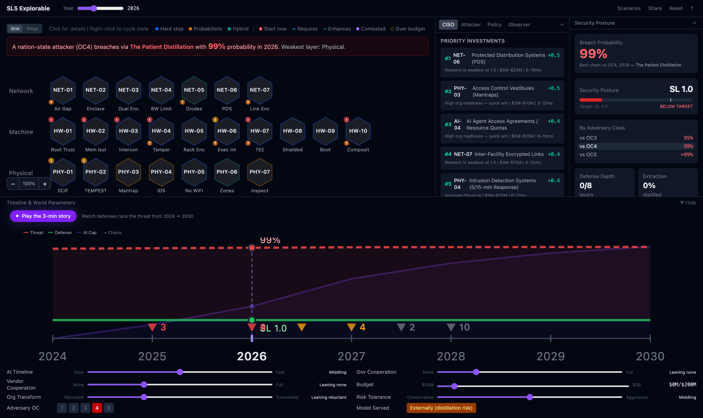

# SL5 Explorable

**An interactive instrument for understanding what it takes to defend frontier AI model weights from nation-state attackers.**

🔗 **[Live demo →](https://nitzpo.github.io/sl5/)**



> ⚠️ **Disclaimer.** This is an educational, illustrative model — not authoritative security guidance. The blocks, attack chains, costs, and probabilities are a *modeling interpretation* synthesized from public sources (see [Data & sources](#data--sources)), not official figures. Use it to build intuition, not to make procurement or accreditation decisions.

---

## What is this?

SL5 Explorable is an *explorable explanation* — a manipulable instrument rather than a dashboard or a report. You assemble a security posture out of ~47 defensive **building blocks**, dial in **world-state assumptions** (AI timeline, budget, government/vendor cooperation, adversary capability), and watch the breach probability, security level, and attack viability respond in real time.

"SL5" is the top of a 1–5 **Security Level** scale: resistance to a top-tier nation-state adversary (operational-capability level **OC5**) that is willing to spend years and hundreds of millions of dollars to steal a model's weights. Even **SL4** is aspirational for most labs today.

**Audience:** policymakers, AI-lab security leaders, and the wider AI-security community.

The tool is built around **two simultaneous races**:

1. **The deployment race** — can defenders stand up enough independent layers *before* the threat arrives? Some blocks (air-gapped facilities, custom silicon) have 36–48-month lead times, so the decision window is closing now.
2. **The futureproofing race** — which defenses stay effective as AI amplifies attackers? **Hard stops** (air gap, cryptography, memory isolation) are future-proof; **probabilistic** defenses (monitoring, vetting, review) erode as adversary capability climbs.

### Ideas it tries to make tangible

- **SL5 is extremely hard** — stacking enough *independent* layers to stop OC5 is a multi-year, multi-hundred-million-dollar program.
- **OC4 → OC5 is a qualitative jump**, not just a bigger budget.
- **Strong AI shifts the OC scale** — capabilities that are OC5-only today move within reach of lesser actors over time.
- **Insider threat is a distinct, hard-to-mitigate class** — including the AI system itself acting as an insider.
- **Time pressure is real** — long-lead blocks must be started years ahead.

---

## How the model works

Everything runs client-side from JSON data — no backend.

- **Building blocks** (`app/public/data/blocks-*.json`) — each block has a category, a **defense type** (🔵 hard-stop / 🟠 probabilistic / 🔷 hybrid), cost, deploy time, an effectiveness curve, an AI-erosion rate, dependencies, and which defense-in-depth layer(s) it contributes to. A block moves through states: *not started → investing → implementing → deployed → mature.*
- **Attack chains** (`app/public/data/attack-chains.json`) — multi-step exfiltration scenarios (e.g., *The Quiet Tap*, *The Poisoned Chip*, *Patient Distillation*). Each names the blocks that would stop it and the adversary level required.
- **Breach probability** is **capability-gated and monotonic**: for a chain,

  ```
  P(breach) = precondition × gate(min_OC) × ∏ get-past(block) × defense-in-depth-discount
  ```

  The **capability gate** asks whether the adversary can even attempt the chain (it scales with OC and with AI capability over time). The per-block **get-past** term falls from 1 (absent) toward ~0 as a defense matures — so improving a defense can *never* raise breach probability. Hard stops are deterministic; probabilistic defenses weaken against stronger adversaries and erode as AI advances. Independent deployed layers earn a defense-in-depth discount; correlated ones (shared dependencies) earn less.
- **Security Level** is a hybrid of weakest-link and harmonic-mean per-category scores.
- **Budget** is binding: blocks funded past the budget cap are capped at "implementing" effectiveness.

The methodology and calibration are documented in [`research/`](research/) — see `scoring-model.md`, `design-decisions.md`, `distillation-analysis.md`, and `formula-calibration-results.md`. JSON schemas live in [`research/schema/`](research/schema/).

---

## Run locally

```bash
cd app
npm install
npm run dev        # http://localhost:5173/sl5/
```

Other scripts:

```bash
npm run build      # type-check + production build to app/dist
npm run preview    # serve the production build
npm test           # run the engine unit tests (vitest)
npm run lint       # eslint
```

Requires Node 20+. The app is desktop-only (it gates small screens).

---

## Project structure

```
.
├── app/                      # the React + TypeScript + Vite app (the explorable)
│   ├── src/
│   │   ├── components/        # SVG views: grid, rings, analysis panels, timeline
│   │   ├── engine/            # scoring, breach, budget, AI-curve, distillation
│   │   ├── store/             # Zustand state (simulation, derived, view, persistence)
│   │   ├── timelapse/         # scripted scenario playback
│   │   └── utils/             # geometry, colors, decision windows
│   ├── public/data/           # canonical block + attack-chain data (JSON)
│   └── tests/engine/          # vitest unit tests for the scoring/breach engines
├── research/                 # methodology, design notes, JSON schemas, source material
└── .github/workflows/        # GitHub Pages deploy
```

---

## Data & sources

The block and attack-chain data is an **illustrative modeling interpretation** synthesized from public material — not a reproduction of any source document:

- RAND, *Securing AI Model Weights* (RRA2849-1)
- The **SL5 Standard for AI Security** and its **Novel Recommendations**
- The **AI 2027** forecast

Canonical data the app loads is in `app/public/data/`. `research/data/` is a frozen snapshot used by the legacy Python prototype (`research/scenario-test.py`); see [`research/README.md`](research/README.md).

---

## Contributing

Issues and PRs welcome. Common changes:

- **Add or tune a building block** — edit `app/public/data/blocks-*.json` following `research/schema/building-block.schema.json`.
- **Add an attack chain** — edit `app/public/data/attack-chains.json` (`research/schema/attack-chain.schema.json`); optional `narrative.steps` and `stopper_details` power the chain strip.
- **Engine changes** — keep `npm test` green; the breach model's monotonicity and capability-scaling are asserted in `app/tests/engine/breach.test.ts`.

---

## License

[MIT](LICENSE) © 2026 Nitzan Pomerantz.

## Acknowledgments

Built on the public analysis of RAND and the authors of the SL5 Standard and its Novel Recommendations, and informed by the AI 2027 forecast.
